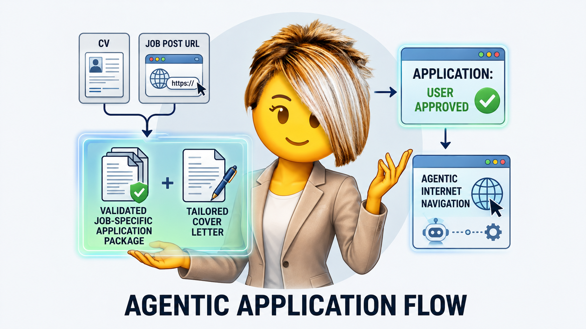
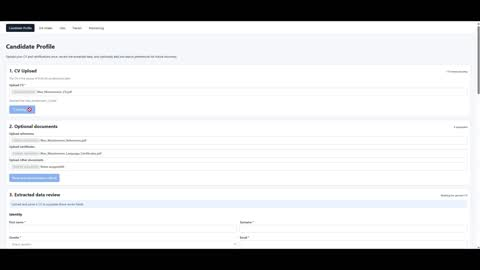
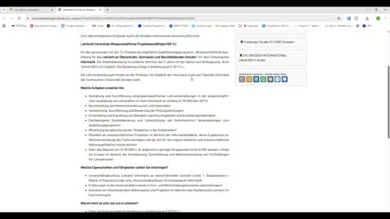
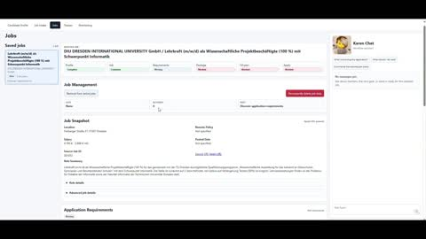
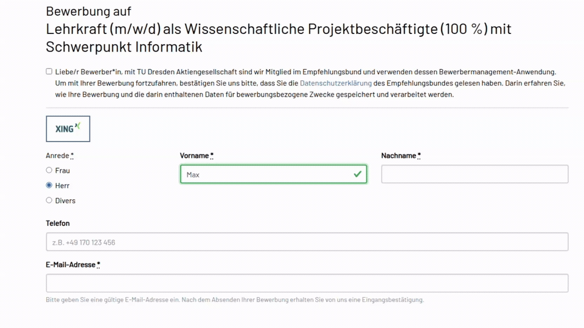
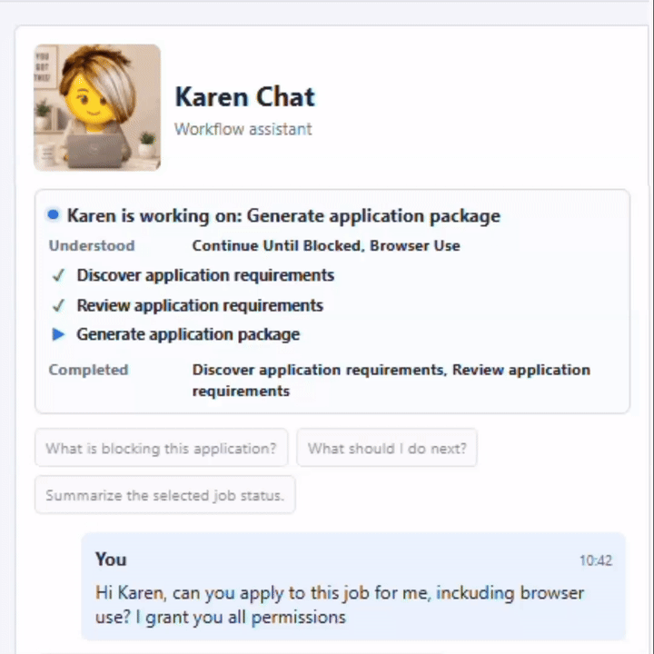
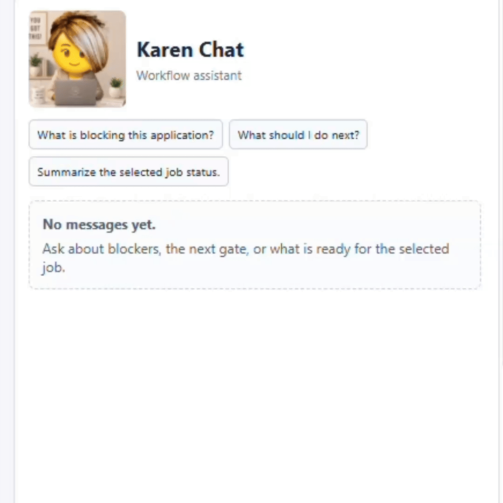
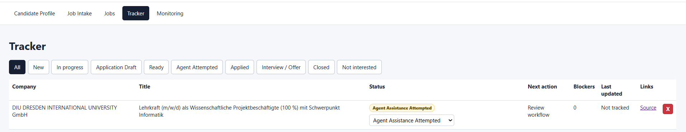
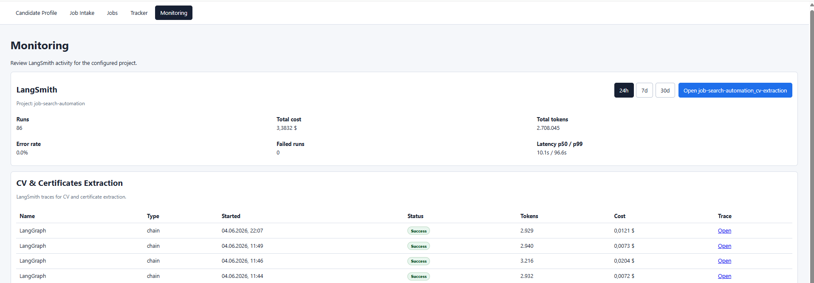
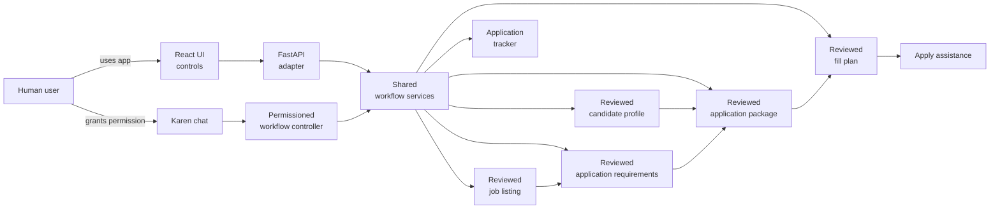

# Job Search Automation


Agentic AI workflow for turning a CV and a job URL into a reviewed,
job-specific application package, then using browser navigation to assist the
application flow.

The app extracts candidate and job information, discovers application
requirements, generates tailored materials, prepares form answers, tracks
application status, and can launch an agentic browser session from reviewed
inputs. AI handles the language-heavy work; deterministic workflow code keeps
state, validation, blockers, review gates, and final-submit protection under
control.

```text
candidate profile + job position
    -> validated application package
        -> automatic application via agentic internet browser
```



## How to Use the App

Click any thumbnail to open the matching full walkthrough GIF.

| What you do | Walkthrough |
| --- | --- |
| **Candidate Profile**<br>1. **Upload CV** and **parse with AI** -> **review and confirm**.<br>2. **Upload references and certificates** and **parse with AI** -> **review and confirm**.<br>3. **Add preferences**. | [](assets/product/gifs/01_candidate_profile_full.gif) |
| **Job Intake**<br>1. **Paste job URL** and **parse with AI** -> **review and confirm**.<br>2. **Save job**. | [](assets/product/gifs/02_job_intake_full.gif) |
| **Jobs Workflow**<br>1. **Discover requirements** -> **review and confirm**.<br>2. **Generate application package** -> **review and confirm**. | [](assets/product/gifs/03_job_application_manual_full.gif) |
| **Agentic Navigation**<br>1. **Generate fill details** -> **review and confirm**.<br>2. **Launch Browser Use** -> **review before final submission**. | [](assets/product/gifs/04_agentic_browser_navigation_full.gif) |

## Agent Karen Support

Karen can help you move through the workflow by explaining what is ready, what is blocked, and what needs your review.
With your permission, Karen can trigger the same workflow actions available in the UI while keeping human review gates in place.

| Run permitted workflow steps | Explain blockers and next actions |
| --- | --- |
| <a href="assets/product/gifs/05_karen_job_process_automatic.gif"></a> | <a href="assets/product/gifs/07_karen_helping_process.gif"></a> |

## Other features

| Job tracker | Langsmith Monitoring |
| --- | --- |
|  |  |

## Product Flow



The core design principle is simple: the human can operate the workflow directly
through the UI or ask Karen to do permitted steps. Both paths converge on the
same backend workflow services and persisted artifacts. Karen does not own a
parallel implementation or bypass review gates.

## What It Does

| Area | Capability |
| --- | --- |
| Candidate profile | Builds structured candidate data from a CV and optional supporting documents. |
| Job intake | Extracts and normalizes job details from a job URL, then shows editable review fields. |
| Requirements discovery | Inspects the reviewed apply URL to identify documents, form fields, and screening questions. |
| Application package | Generates tailored cover letter drafts, CV tailoring notes, recruiter messages, form answers, and upload checklists. |
| Fill plan | Maps reviewed candidate/package data onto discovered application fields before browser assistance starts. |
| Karen assistant | Explains blockers, routes the user to the right page, and can request the same shared backend workflow actions as UI controls when permitted. |
| Tracker | Keeps saved jobs and application status visible across the workflow. |

## What It Does Not Do

| Boundary | Reason |
| --- | --- |
| No automatic final submission | The user remains responsible for final review and submission. |
| No login, MFA, captcha, or account creation automation | These are sensitive account actions and stay outside the assistant workflow. |
| No invented candidate data | Missing information must be supplied or reviewed by the user. |
| No review-gate bypasses | Candidate data, job data, requirements, packages, and fill plans remain human-controlled. |
| No LinkedIn scraping | The core workflow is independent of fragile or policy-sensitive scraping paths. |

## Known Limitations

Browser assistance is schema-dependent. It works on many job applications, but
it may block or require manual fallback when the site does not expose a clear
job description, apply button, and follow-up application page containing the
requested user-provided materials and form fields.

## Why This Project Matters

Job applications are repetitive, but the important decisions should stay visible
and controlled. This project shows how AI can help without turning the workflow
into an opaque auto-apply system.

- **AI handles language-heavy work:** CV extraction, job-offer interpretation,
  requirement discovery, field mapping, and application drafts.
- **Deterministic code controls the workflow:** state, validation, review gates,
  blockers, storage, URL checks, package quality checks, and Browser Use launch
  rules.
- **Human review stays central:** generated packages link back to reviewed job
  requirements and candidate evidence before use.
- **Karen follows the same path as the UI:** assistant actions call the same
  backend workflow actions instead of creating a separate automation path.
- **External services stay replaceable:** integrations are wrapped behind narrow
  boundaries that can be traced, mocked, retried, disabled, or replaced.
- **Verification is broad:** tests cover Python workflow logic, API contracts,
  frontend behavior, type checks, production build, and browser smoke flows.

## Engineering Approach

- **AI output is draft data, not trusted state.** Generated content must pass
  through reviewable workflow steps before it is used.
- **Workflow artifacts are structured.** Key outputs can be reviewed, edited,
  approved, rejected, regenerated, traced, and tested.
- **State changes are explicit.** Review gates, blockers, and persistence rules
  live in deterministic backend workflow logic.
- **Karen is a workflow controller.** She can explain state and request allowed
  actions, but she dispatches through the same shared workflow registry as the
  UI.

## LangSmith Observability

The app can trace LLM-powered workflow steps to LangSmith. This makes prompts,
structured outputs, tool behavior, latency, and failures inspectable during
development. The app includes a Monitoring tab for observability context, while
the detailed tracing notes live in
[docs/langsmith/langsmith_overview.md](docs/langsmith/langsmith_overview.md).

Optional LangSmith configuration:

```env
LANGSMITH_API_KEY=your_langsmith_api_key
LANGSMITH_TRACING=true
LANGSMITH_PROJECT=job-search-automation
LANGSMITH_DASHBOARD_URL=https://smith.langchain.com/...
```

## Tech Stack

| Layer | Technology | Role |
| --- | --- | --- |
| Frontend | React, TypeScript, Vite | Review-first workflow UI and typed client behavior |
| Backend API | FastAPI, Python, Pydantic | Thin adapter over validated workflow models |
| Workflow | Python modules with LangGraph-compatible slices | Explicit state transitions, blockers, and review gates |
| AI boundary | OpenAI structured outputs through `src/llm_client.py` | Bounded language reasoning with retries, timeouts, and trace metadata |
| Observability | LangSmith | Inspectable prompts, outputs, latency, failures, and model behavior |
| Browser assistance | Browser Use | Launched only from reviewed fill plans with final-submit protection |
| Storage | Local JSON files under `data/`, generated exports under `outputs/` | Inspectable local state and review artifacts |
| Testing | Ruff, pytest, TypeScript checks, Vitest, Playwright | Regression checks across backend, API, UI, and browser flows |

## Install

Create and activate a virtual environment:

```bash
python -m venv .venv
source .venv/bin/activate
```

Install Python dependencies:

```bash
pip install -r requirements.txt
```

Install frontend dependencies:

```bash
npm install
```

Install the browser used by Playwright smoke tests:

```bash
npx playwright install chromium
```

This README uses public, portable setup commands. Repository-local automation
instructions for coding agents live in [AGENTS.md](AGENTS.md).

AI-assisted workflows require:

```env
OPENAI_API_KEY=your_openai_api_key
OPENAI_MODEL=gpt-5.4
```

## Run Locally

Start both development servers with one command:

```bash
make dev
```

This runs the FastAPI backend at `http://127.0.0.1:8001` and the Vite frontend
at `http://127.0.0.1:5173`. Press `Ctrl+C` in that terminal to stop both.

The separate commands still work if you prefer two terminals.

Start the FastAPI backend:

```bash
uvicorn src.api:app --host 127.0.0.1 --port 8001 --reload
```

Start the Vite frontend in a second terminal:

```bash
npm run frontend:dev
```

Open:

```text
http://127.0.0.1:5173/
```

During local development, the frontend calls `http://127.0.0.1:8001` by
default. Set `VITE_API_BASE_URL` if the API is running somewhere else.

## Verify

```bash
make verify
```

This runs Python linting, Python compile checks, pytest, frontend typecheck,
Vitest component tests, Vite production build, and Playwright smoke tests.

To reset private local runtime state while keeping checked-in templates:

```bash
make clean-local-state
```

## Documentation

| Document | Covers |
| --- | --- |
| [Project specification](PROJECT_SPEC.md) | Product scope, workflow rules, and boundaries. |
| [Implementation plan](IMPLEMENTATION_PLAN.md) | Delivered features, current status, and future phases. |
| [Current architecture](docs/current_architecture.md) | React, FastAPI, Python workflow modules, JSON storage, Karen, and verification. |
| [Test strategy](docs/test_strategy.md) | Python, API, React, and Playwright testing boundaries. |
| [Research foundation](docs/research_foundation.md) | Job intake decisions, Browser Use options, and external-provider tradeoffs. |
| [UI migration parity](docs/ui_migration_parity.md) | React migration behavior and workflow parity notes. |
| [GDPR audit](docs/GDPR_Audit.md) | Privacy and data-handling review. |
| [EU AI Act audit](docs/job_search_automation_eu_ai_act_audit.md) | AI risk and compliance notes. |
| [LangSmith overview](docs/langsmith/langsmith_overview.md) | Tracing setup and observability screenshots. |
