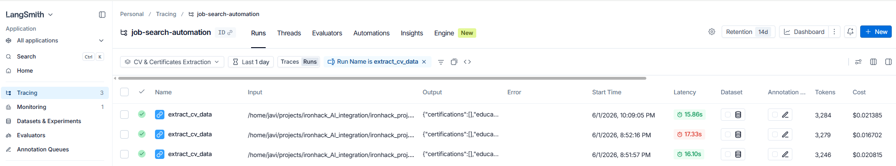
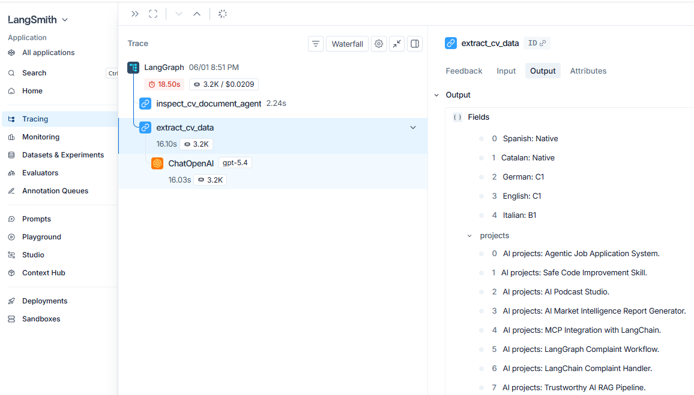
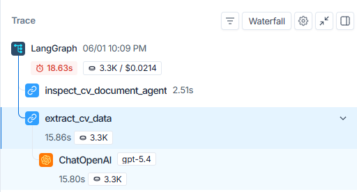
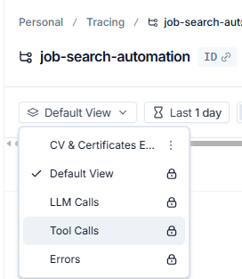
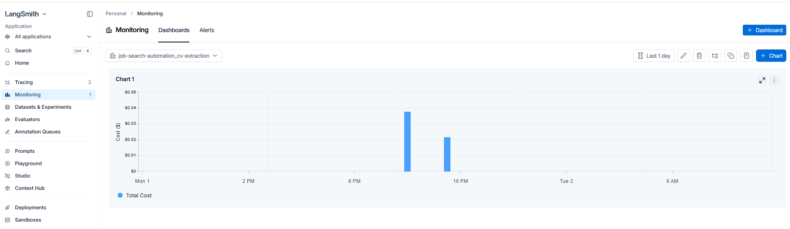

# LangSmith Value Overview

LangSmith adds an operational layer around LLM-based workflows. It helps teams inspect what happened, measure runtime behavior, review outputs, and later test changes systematically.

---

## 1. Tracing

Tracing records individual AI workflow runs.

It shows:

- workflow steps
- model calls
- inputs and prompts
- outputs
- latency
- token usage
- estimated cost
- errors and retries
- nested execution paths

Value:

- makes LLM behavior inspectable
- helps debug bad outputs
- shows where time and cost are spent
- supports incident review when something fails

**Screenshot**

---

## 2. LLM Call Visibility

LangSmith can show the actual model interaction behind a workflow step.

It can expose:

- model used
- prompt/messages
- structured response
- token usage
- cost
- response time
- failure details

Value:

- verifies what was actually sent to the model
- helps detect weak prompts or wrong inputs
- makes model behavior easier to audit
- helps compare model usage across workflows

**Screenshot**

---

## 3. Trace Trees for Multi-Step Workflows

For workflows using chains, graphs, or multiple AI steps, LangSmith shows the execution tree.

It helps separate:

- document inspection
- extraction
- transformation
- generation
- validation
- final output

Value:

- shows where a workflow failed
- avoids treating the AI system as one black box
- makes complex workflows easier to explain
- helps distinguish deterministic code from LLM reasoning

**Screenshot**

---

## 4. Saved Views and Filters

Saved views isolate specific workflow activity.

Examples:

- CV extraction runs
- job extraction runs
- requirements extraction runs
- application package generation runs
- field mapping runs
- failed runs
- slow runs
- expensive runs
- runs from a specific project or environment

Value:

- reduces noise in the tracing board
- makes debugging faster
- allows focused monitoring per workflow
- helps different stakeholders look only at relevant runs

**Screenshot**

---

## 5. Dashboards and Monitoring

Dashboards aggregate trace data across multiple runs.

In the application, the React Monitoring tab reads LangSmith project activity
and groups recent runs by workflow:

- Candidate Profile
- Job Intake
- Jobs
- Karen
- Browser Automation

The Jobs group includes apply URL ranking, requirements extraction,
application package generation, and field mapping. New job-scoped traces store
the specific step as `workflow_subcategory_key` and
`workflow_subcategory_label` metadata.

Useful metrics:

- total cost
- average cost
- total tokens
- average latency
- run count
- error count
- failure rate
- latency trends

Value:

- gives an operational overview
- supports cost control
- detects slow or unstable workflows
- avoids manual inspection of every trace

**Screenshot**

The screenshot below is the original CV extraction custom dashboard example.
The in-app Monitoring tab now uses the broader workflow grouping above.

---

## 6. Manual Feedback and Annotations

LangSmith can attach human feedback to runs.

Examples:

- correct extraction
- missing information
- hallucinated claim
- too generic
- needs rewrite
- approved
- rejected

Value:

- captures expert review
- creates quality signals from real usage
- helps identify recurring failure patterns
- prepares data for later evaluation

**Screenshot placeholder:** capture a manual feedback example when this view is available.

---

## 7. Datasets

Datasets store fixed examples for repeatable testing.

A dataset can contain:

- input CV text
- expected extracted fields
- job description examples
- expected application answers
- reference outputs

Future LangSmith datasets should cover job extraction, requirements extraction,
apply URL resolution, field mapping, application package grounding, and Karen
intent classification once their fixture inputs and scoring criteria are stable.

Value:

- creates a regression-test base for AI workflows
- allows the same cases to be tested after prompt/model/code changes
- prevents relying only on manual spot checks
- makes quality comparisons reproducible

**Screenshot placeholder:** capture a dataset example when this view is available.

---

## 8. Evaluators

Evaluators score workflow outputs.

They can be:

- deterministic Python checks
- schema checks
- completeness checks
- unsupported-claim checks
- LLM-as-judge checks
- human feedback based checks

Value:

- turns manual review criteria into measurable checks
- detects regressions automatically
- supports quality gates before changing prompts or models
- helps measure whether outputs are usable, accurate, and grounded

**Screenshot placeholder:** capture evaluator results when this view is available.

---

## 9. Experiments

Experiments run a workflow over a dataset and record evaluation results.

They can compare:

- prompt version A vs prompt version B
- model A vs model B
- extraction logic before and after a code change
- different temperature or token settings

Value:

- supports evidence-based changes
- shows whether a modification improved or degraded quality
- combines quality, latency, and cost comparison
- makes AI workflow changes testable instead of subjective

**Screenshot placeholder:** capture an experiment comparison when this view is available.

---

## 10. A/B Comparison

LangSmith can compare experiment runs side by side.

Useful comparisons:

- cheaper model vs stronger model
- old prompt vs new prompt
- deterministic extraction vs LLM-assisted extraction
- different application-generation strategies

Value:

- supports model and prompt selection
- exposes tradeoffs between quality, speed, and cost
- helps justify technical decisions with data

**Screenshot placeholder:** capture an A/B comparison when this view is available.

---

## Summary

| Capability | Main value |
|---|---|
| Tracing | Inspect what happened in each AI run |
| LLM call visibility | See prompts, outputs, tokens, cost, latency |
| Trace trees | Understand multi-step workflows |
| Saved views | Focus on specific workflow areas |
| Dashboards | Monitor cost, latency, volume, and failures |
| Feedback | Capture human review signals |
| Datasets | Build repeatable test cases |
| Evaluators | Score output quality |
| Experiments | Compare workflow/model/prompt changes |
| A/B comparison | Make model and prompt choices evidence-based |

LangSmith is useful once LLM workflows move beyond experimentation and need debugging, monitoring, review, and controlled improvement.
